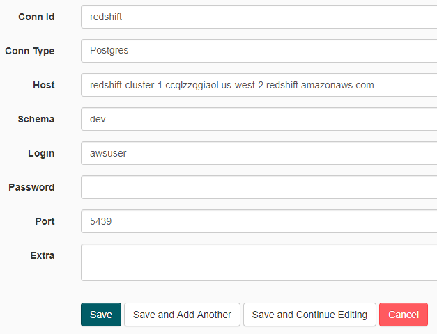

# airflow-data-pipeline

### Introduction
A music streaming company, Sparkify, has decided that it is time to introduce more automation and monitoring to their data warehouse ETL pipelines and come to the conclusion that the best tool to achieve this is Apache Airflow.

The source data resides in S3 and needs to be processed in Sparkify's data warehouse in Amazon Redshift. The source datasets consist of JSON logs that tell about user activity in the application and JSON metadata about the songs the users listen to.

### Project Dataset
The project uses two datasets, one for the songs metadata and other one for the user activity on the app. The datasets are stored on AWS S3.
- Songs Data: s3://udacity-dend/song_data
- Logs Data: s3://udacity-dend/log_data

### Data Model
The data model resembles a star schema with one Fact table, songplays and four dimension table: users, songs, artists and time. A star schema provides the advantages of higher query performance, built-in referential integrity and ease of understanding.

### Project Structure
- udac_example_dag.py: This is the DAG file which contains the different tasks in the DAG workflow and defines their dependencies. It should be placed in the dags directory of the Airflow installation.
- create_tables.sql: This file contains the create statements for all the tables in our data warehouse. This is one of the first steps in the workflow. It should be placed in the dags directory of the Airflow installation.
- sql_queries.py: This file contains the SELECT statements for inserting data in the tables in the data warehouse. It should be placed in the plugins>helpers directory of the Airflow installation.
- stage_redshift.py: This file defines the StageToRedshiftOperator used in one of the tasks in DAG. The operator copies the JSON data from the S3 buckets to the staging tables in the data warehouse. It should be placed in the plugins>operators directory of the Airflow installation.
- load_fact.py: This file defines the LoadFactOperator used in one of the tasks in DAG. The operator loads the fact table by using the SELECT query in the sql_queries file. It should be placed in the plugins>operators directory of the Airflow installation.
- load_dimension.py: This file defines the LoadDimensionOperator used in one of the tasks in DAG. The operator loads the dimension tables by using the SELECT query in the sql_queries file. It should be placed in the plugins>operators directory of the Airflow installation.
- data_quality.py: This file defines the DataQualityOperator used in one of the tasks in DAG. The operator compares the result returned by the user supplied query with the expected_result variable and passes/fails the test case. It should be placed in the plugins>operators directory of the Airflow installation.

### Project Steps
1. In a AWS account, create a user with read access to S3 and create a connection in the Airflow UI using the access key id and secret access key.

2. Create a Redshift cluster in AWS and then create a connection in the Airflow UI using the ARN name, database name, user details and port number.

3. In the Airflow UI, toggle the DAG switch to ON and the DAG would either start executing on its own based on the schedule provided in the udac_example_dag file or can be initiated manually in the UI.
4. Go to Graph view to verify the task dependencies as per the intended workflow. 
5. Upon successful completion of the DAG, verify the data in the fact and dimension tables.
6. DON'T FORGET to delete your cluster if you don't intend to use it later.
